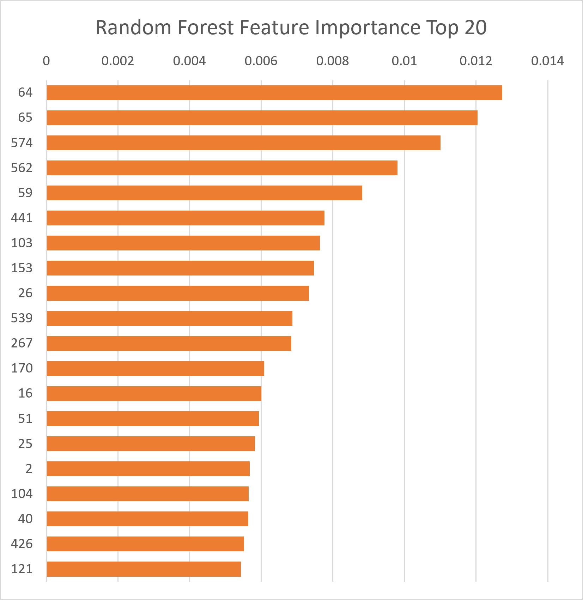
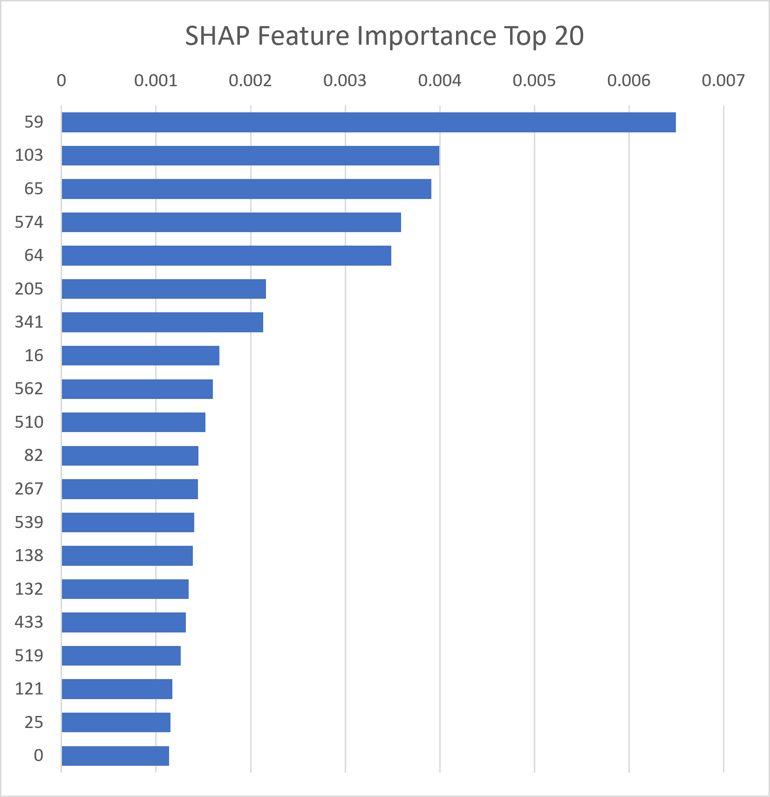

# 제조 공정 센서 데이터를 활용한 불량 예측 및 주요 영향 인자 분석

## 1. Project Overview

디스플레이 및 반도체 제조 공정에서는 다수의 센서를 통해 공정 상태를 모니터링한다.
본 프로젝트에서는 Fab 공정 센서 데이터를 활용하여 **제품의 Pass/Fail을 예측하고, 모델 해석을 통해 불량 판별에 영향을 미치는 주요 센서를 도출**하였다.

단순한 불량 예측에 그치지 않고, Feature Importance와 SHAP을 활용하여 **품질 관리 관점에서 우선적으로 확인할 공정 변수 후보를 선정**하는 것을 목표로 하였다.

---

## 2. Project Goal

* 제조 공정 센서 데이터의 품질 및 분포 분석
* Pass/Fail 불균형 데이터에 대한 전처리 및 모델링
* 불량 예측 모델 구축 및 성능 평가
* Feature Importance 및 SHAP 기반 주요 영향 센서 도출
* Pass/Fail 그룹 간 주요 센서 특성 비교

---

## 3. Dataset

| 항목              | 내용                      |
| --------------- | ----------------------- |
| Dataset         | `fab_process_yield.csv` |
| Samples         | 1,567건                  |
| Sensor Features | 590개                    |
| Target          | Pass / Fail             |
| Pass            | 1,463건                  |
| Fail            | 104건                    |
| Fail 비율         | 6.64%                   |

불량 데이터가 전체 데이터의 6.64%로 상대적으로 적은 **Class Imbalance** 구조를 가지고 있었다.

따라서 단순 Accuracy보다는 **Recall, F1-score, PR-AUC 등 불량 탐지 성능을 함께 확인**하였다.

---

## 4. Data Preprocessing

### Sensor Filtering

다음 조건에 해당하는 센서를 제거하였다.

* 변화가 없는 Constant Sensor
* 결측률 50% 이상인 Sensor

결과적으로:

```text
590 Sensors
     ↓
144 Sensors Removed
     ↓
446 Sensors
```

### Missing Value Handling

남은 결측치는 **Median Imputation**을 적용하였다.

센서 데이터의 극단값에 의해 평균이 크게 영향을 받을 가능성을 고려하여 중앙값을 사용하였다.

---

## 5. Modeling

### Logistic Regression

Baseline 모델로 Logistic Regression을 사용하였다.

불균형 데이터 대응을 위해:

```python
class_weight="balanced"
```

를 적용하였다.

### Random Forest

비선형적인 센서와 불량 간 관계를 분석하고 Feature Importance를 확인하기 위해 Random Forest를 적용하였다.

주요 설정:

```python
n_estimators=200
class_weight="balanced"
random_state=42
```

---

## 6. Model Evaluation

Logistic Regression Baseline 결과:

| Metric    |  Score |
| --------- | -----: |
| Accuracy  | 0.8376 |
| Precision | 0.1053 |
| Recall    | 0.1905 |
| F1-score  | 0.1356 |
| PR-AUC    | 0.1499 |

Confusion Matrix:

```text
[[259  34]
 [ 17   4]]
```

Accuracy만 보면 83.76%로 나타났지만, 실제 Fail 21건 중 4건만 탐지하여 **불량 Recall이 19.05%**에 그쳤다.

이를 통해 제조 품질 문제에서는 정상 제품을 잘 분류하는 것뿐 아니라 **불량을 놓치지 않는 탐지 성능을 함께 고려해야 함**을 확인하였다.

---

## 7. Random Forest Feature Importance

Random Forest의 Feature Importance를 활용하여 불량 분류에 기여도가 높은 센서를 확인하였다.



### Top 5 Sensors

| Rank | Sensor | Importance |
| ---: | -----: | ---------: |
|    1 |     64 |   0.012729 |
|    2 |     65 |   0.012039 |
|    3 |    574 |   0.011008 |
|    4 |    562 |   0.009805 |
|    5 |     59 |   0.008817 |

Feature Importance Top20을 별도로 저장하여 주요 센서 후보를 추가적으로 확인하였다.

---

## 8. SHAP-based Model Interpretation

Random Forest의 Feature Importance만으로는 각 센서가 개별 예측에 어떤 영향을 미치는지 충분히 설명하기 어렵기 때문에 SHAP을 활용하였다.



### SHAP Top 5 Sensors

| Rank | Sensor |
| ---: | -----: |
|    1 |     59 |
|    2 |    103 |
|    3 |     65 |
|    4 |    574 |
|    5 |     64 |

SHAP 분석을 통해 각 센서의 예측 영향도를 확인하고, Random Forest Feature Importance와 비교하였다.

---

## 9. Key Sensors

두 가지 분석 결과를 비교하여 주요 센서 후보를 도출하였다.

### 공통 주요 센서

* Sensor 64
* Sensor 65
* Sensor 574
* Sensor 59

### 추가 분석 센서

* Sensor 103 — SHAP에서 높은 중요도
* Sensor 562 — Random Forest에서 높은 중요도

따라서 총 6개 센서를 주요 분석 후보로 선정하였다.

```text
64 · 65 · 574 · 59 · 103 · 562
```

---

## 10. Pass / Fail Sensor Comparison

선정된 주요 센서에 대해 Pass와 Fail 그룹의 평균값을 비교하여 모델이 중요하게 판단한 센서가 실제 데이터에서도 그룹 간 차이를 보이는지 확인하였다.

이를 통해 단순히 모델의 중요도를 확인하는 것을 넘어 **데이터 기반으로 주요 공정 변수의 특성을 추가 검토**하였다.

---

## 11. Quality Engineering Perspective

본 프로젝트의 분석 과정은 다음과 같은 품질 분석 흐름으로 연결하였다.

```text
Manufacturing Sensor Data
          ↓
Data Quality Check
          ↓
Abnormal / Missing Data Handling
          ↓
Pass / Fail Prediction
          ↓
Important Sensor Identification
          ↓
Pass / Fail Comparison
          ↓
Potential Quality Control Variables
```

이를 통해 다수의 공정 변수 중 **불량과 관련성이 높은 센서를 우선적으로 확인하고 관리할 수 있는 분석 방향**을 제시하였다.

---

## 12. Tech Stack

* Python
* Pandas
* NumPy
* Scikit-learn
* SHAP
* Matplotlib
* Google Colab

---

## 13. Future Improvement

현재 모델의 불량 탐지 성능을 추가적으로 개선하기 위해 다음과 같은 확장이 가능하다.

* Classification Threshold 조정
* SMOTE 등 불균형 데이터 처리 방법 비교
* XGBoost / LightGBM 등 추가 모델 비교
* 센서 간 상관관계 및 공정 변수 관계 분석
* 시간 순서가 있는 경우 Time-series 기반 이상 탐지
* 실제 공정 조건 및 물리적 의미와 연계한 원인 분석

본 프로젝트에서는 우선 **주요 영향 센서를 도출하고 품질 분석 흐름을 구축하는 것**에 초점을 두었다.

---

## 14. Conclusion

Fab 공정 센서 데이터를 활용하여 불량 예측 Pipeline을 구축하고, Random Forest Feature Importance와 SHAP을 이용하여 주요 영향 센서를 분석하였다.

특히 불균형 데이터에서 Accuracy만을 기준으로 판단하지 않고 **불량 Recall과 PR-AUC를 함께 확인**했으며, 모델 해석 결과를 Pass/Fail 센서 비교로 연결하여 **제조 품질 데이터 분석 관점의 접근 방법을 구축하였다.**
